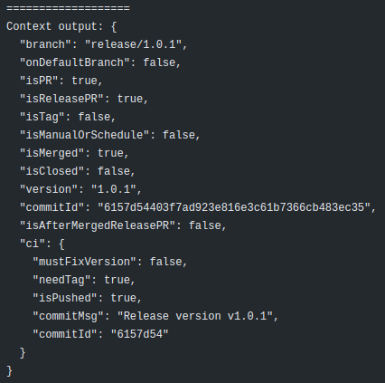

# gh-project-context


Build project context and correct Project version in any language version before release.

This action is build a Project context depends on GitHub event to make decision in further step, e.g: do build, do 
test, do analysis, do tag, do release based on your workflow model.

It also verifies and corrects automatically Project version in metadata file in `release pull request` or `tag`:

- NodeJS: `package.json`
- Java: Gradle with `gradle.properties`
- Python: `Pipenv` or `Poetry` with `pyproject.toml`
- Plain text: `VERSION.txt`
- Or any version metadata file if you know some magical regex skill

## Usage

You can use this action in 2 ways:

- Add it as first `job` in your `workflow`

```yaml
jobs:
  context:
    runs-on: ubuntu-latest
    steps:
      - uses: actions/checkout@v2
      - name: Project context
        id: project_context
        uses: zero88/gh-project-context@v1.0.0-rc

  build:
    runs-on: ubuntu-latest
    needs: context
```

- Add it as first `step` in your `job`

```yaml
jobs:
  matrix:
    runs-on: ubuntu-latest
    steps:
      - uses: actions/checkout@v2
      - name: Project context
        id: project_context
        uses: zero88/gh-project-context@v1.0.0-rc
      - name: build sth
        ...
```

- Action output



### Input and Output

#### Input

| Name                  | Description                                                                                                  | Required | Default value                                     |
| --------------------- | ------------------------------------------------------------------------------------------------------------ | -------- | ------------------------------------------------- |
| defaultBranch         | Project default branch                                                                                       | false    | `main`                                            |
| tagPrefix             | Tag Prefix                                                                                                   | false    | `v`                                               |
| releaseBranchPrefix   | Git Release Branch Prefix                                                                                    | false    | `release/`                                        |
| mergedReleaseMsgRegex | Merged release message regex                                                                                 | false    | `^Merge pull request #[0-9]+ from .+/release/.+$` |
| patterns              | Project patterns to search/replace a version. E.g: `<glob_pattern_with_ext>::<regex_group>::<version_regex>` | false    | `as`                                              |
| allowCommit           | CI: Allow git commit to fix version if not match                                                             | false    | `true`                                            |
| allowTag              | CI: Allow git tag if merged release branch                                                                   | false    | `true`                                            |
| userName              | CI: Username to commit                                                                                       | false    | `ci-bot`                                          |
| userEmail             | CI: User email to commit                                                                                     | false    | `actions@github.com`                              |
| mustSign              | CI: Required GPG sign when git commit/tag                                                                    | false    | `false`                                           |
| prefixCiMsg           | CI: Prefix bot message                                                                                       | false    | `<ci-auto-commit>`                                |
| correctVerMsg         | CI: Correct version message template                                                                         | false    | `Correct version`                                 |
| releaseVerMsg         | CI: Release version message template                                                                         | false    | `release/`                                        |
| dry                   | CI: Dry run. If `true`, action will run without do modify files or git commit/tag                            | false    | `true`                                            |

#### Output

Project context based on current `GitHub event`

| Name                   | Description                                                                                                 |
| ---------------------- | ----------------------------------------------------------------------------------------------------------- |
| branch                 | Current branch name or tag name                                                                             |
| onDefaultBranch        | Check whether current event is on default branch or not                                                     |
| isPR                   | Check whether current event is on pull request or not                                                       |
| isReleasePR            | Check whether current event is on release pull request or not                                               |
| isMerged               | Check whether current event is merged PR                                                                    |
| isClosed               | Check whether current event is close PR but not merged into target branch                                   |
| isAfterMergedReleasePR | Check whether current event is a merged commit after merged release pull request into default branch or not |
| isTag                  | Check whether current event is on ref tag                                                                   |
| commitMsg              | The latest commit message                                                                                   |
| commitId               | The latest commit id                                                                                        |
| version                | Current tag version or release version. Null if not tag or release pull request                             |
| ci_mustFixVersion      | CI: Need to fix version to match with release name                                                          |
| ci_needTag             | CI: Need to tag new version if release branch is merged                                                     |
| ci_isPushed            | CI: Check whether if auto commit is pushed to remote                                                        |
| ci_commitId            | CI: auto commit id                                                                                          |
| ci_commitMsg           | CI: auto commit message                                                                                     |


## Use Cases

TBD
